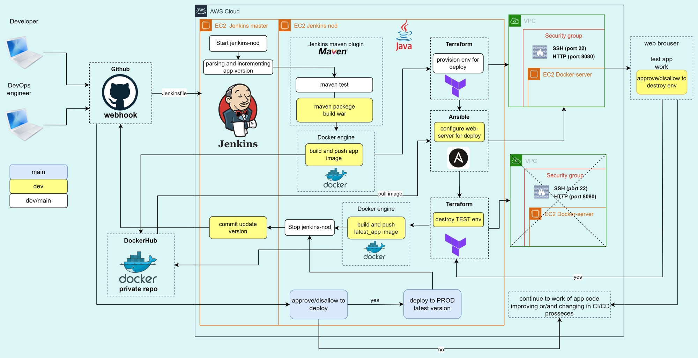

# \<epam> DevOps External Online Course 2022

## Final project: CI/CD pipeline for “java-maven-app"

 Kyiv 2023

created by Marharyta Romaniuk

## Motivation:

   
- This is my first CI/CD project, so main motivation is understanding CI/CD concept and related technologies
- Practical motivation is creating functionality that provides CI/CD for developers who working with web-based application

## Relevance:

- The proposed way of pipeline building make possible to monitor application work in real time and deploy the necessary infrastructure for its operation. It allows continuous improvement, but at the same time not stopping development processes

## Goals:

- Show in practice the level of mastery of DevOps tools and technologies learned during the educational course.
-  Creating a full CI/CD pipeline with AWS, Git, Jenkins, Docker, DockerHub, Terraform, Ansible.
-  Automation of repetitive processes in order to reduce the influence of human factor in the development process.
-  Increase the efficiency of the application development process, as well as the speed of deployment of the finished web-application.

## Selected technologies and tools:

+ Version control system: Git (GitHub)
+ Cloud provider: AWS (VPC, EC2, S3)
+ Containerization: Docker 
+ Image storage: DockerHub
+ IaC: Terraform
+ CI/CD: Jenkins
+ Configuration Automation: Ansible

# Scheme of Project:

## Realization:

In the dir `src` is the java-maven project code, which I cloned from
https://github.com/denofprogramming/maven-java-web-application

I make some changes in [index.jsp file](src/main/webapp/index.jsp) for visually show the changes in the app during the CI/CD proccess demonstration.

+ In the **first stage** "Start jenkins-nod" is started Jenkins-nod.
It is pre-launched in AWS via terraform, with the required software packages  pre-installed via bootstrap.sh 

+ After pushing to the "dev" branch at the GitHub repository, a webhook triggers a Jenkins pipeline. 
+ **Stage:** "Parsing and incrementing" application version and creating  some environmental variables for the pipeline
+ **Stages:** "test app", "build war"

The `mvn`  commands are executed through the Maven 3.8 plugin, that was configured on the Jenkins server as tool
  
`mvn test` - execute the unit tests in a Maven project (for all branches) 

`mvn package` - Maven compiles Java code and packages it into a WAR (skipped in main branch, executed in dev branch)

+ **Stage:** "build and push app image"

`docker build` - from Dockerfile and war artifact creates Docker Image and is pushed to DockerHub (skipped in main branch, executed in dev branch)

Images *version* with the number of jenkins build in the tag:

`$version-$BUILD_NUMBER`   for dev

`$version-latest`   for main (prod)

+ **Stage:** "provision web-server for deploy"

`terraform apply` - create an environment for further deploying  (for both branches, for main it should check that env exists)

+ **Stage:** "deploy to TEST via ansible"

`ansible-playbook` - installed Docker on the created env and pull Image from the DockerHub

extra variables passed to the playbook as arguments

`-e docker_password=$PASSWD`

`-e docker_image=$IMAGE_NAME`

+ **Stage:** "approve/disallow to destroy env"
  
Manual confirmation that the deploy was successful - go to the dev-WebSerwer IP address and check application`s work.
Verify the further pipeline execution (dev branch)

+ **Stage:** "destroy env"

`terraform destroy` - destroys TEST env after checking the app work (only for dev branch)

Stop Jenkins-nod and commit update version to GitHub
In first iteration need to set global configuration for access to git repo (dev branch)

Merge dev to main triggers webhook on main branch and the previously described stages for the main branch are performed.
Manual confirmation to deploy the latest version of the application to the PROD env.
Go to the main-WebSerwer IP address and see how the updated application works.

